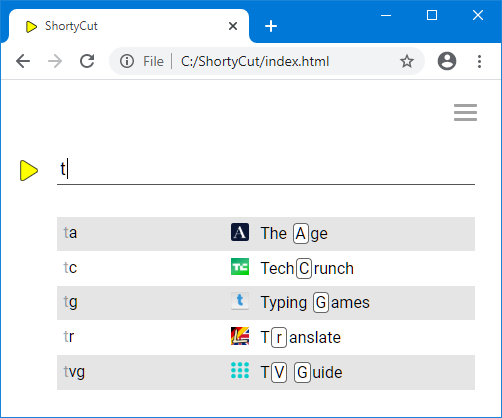
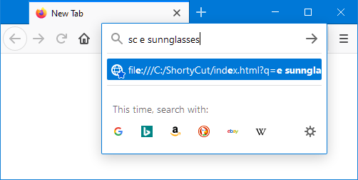
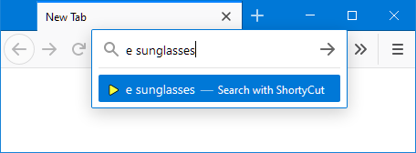

#  Browser integration

To intercept keywords and redirect to the corresponding pages, ShortyCut needs to be integrated with the browser.
There are different methods to accomplish this.

##  Homepage

Using ShortyCut's homepage is the easiest approach that works across all browsers.
It's also the most convenient way to enter keywords because it displays suggestions:

ShortyCut's homepage can be set as the browser's start page or pinned as a permanent tab.
See "[Homepage](homepage.md)" for details.

##  Keyword query

A keyword query is a lightweight method to make shortcuts accessible through the browser's address bar.
ShortyCut itself is bookmarked and a keyword is assigned to it.
This only works with browsers that natively support keywords.

The keyword assigned to the ShortyCut bookmark (e.g. `sc`) needs to be entered before the actual keyword itself.
If the shortcut `e` performs a product search on eBay, then a search for sunglasses would be started via:

Having to enter ShortyCut's own keyword (`sc`) first, allows it to be used on a case-by-case basis,
while preserving the address bar's default behavior for everything else.
See "[Keyword query](keyword-query.md)" for details.

##  Web server

When ShortyCut is accessed through a web server, it can be used as the browser's default search engine.
Keywords can be entered directly in the address bar, without requiring an additional keyword for ShortyCut itself:

This method has better browser support than keyword queries.
However, it requires a small web server to run on the local machine
or ShortyCut to be uploaded to a web hosting service.
See "[Web server](web-server.md)" for details.
