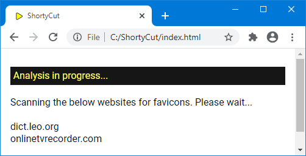
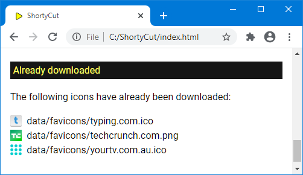

#  Favicons

ShortyCut displays websites' favicons to make it easier to spot the right suggestion:

While entering keywords, the list of suggestions often changes rapidly.
Adding another letter might remove most of the previous suggestions and show others instead.
At the same time, loading the icons is quite slow and can take several seconds.
Subsequently, the icons often show up too late.

One way of dealing with this problem is to download all favicons for quicker access.
When loaded from a local disk drive, there's hardly any noticeable delay.
Alternatively, favicons can be disabled altogether.
This is done by setting the configuration property
[showFavicons](configuration.md#homepagesuggestionsshowfavicons) to `false`.

##  Favicon tools

ShortyCut contains a favicon tools page which helps with the review and download of favicons.
It can be accessed via the menu on the homepage:

It scans all shortcuts to determine which favicons have been or should be downloaded:

This might take a while. Make sure to wait until all links have been checked before proceeding.

##  Downloadable favicons

The first section of the page shows a list of all favicons that are available for download:

Due to browser restrictions, each favicon must be downloaded and renamed manually:

- Right-click on the icon and save the image
- Rename the saved file to the filename displayed next to the icon
- Move all icons into the `favicons` folder (inside the `data` folder)

Favicons can also be downloaded automatically by pasting the provided `curl` commands into a terminal.
This requires familiarity with the command line.

##  Missing favicons

The next section of the page displays websites that don't have a standard favicon:

When downloading icons from elsewhere, the base filename (without extension) must be exactly as displayed in the list.
For example, the icon for `dict.leo.org` could be saved as `dict.leo.org.ico`.
The file extensions can be `ico`, `jpg`, `png` or `svg`.

##  Downloaded favicons

The last section of the page lists all favicons that have already been downloaded:

It can be used to very that favicons are in the right folder and have the correct filename.
The list does not contain favicons for websites which don't have a corresponding shortcut.
