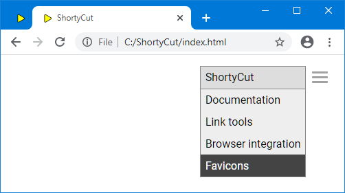

#  Favicons

ShortyCut displays websites' favicons, making it easier to spot the right suggestion:


While entering keywords, the list of suggestions often changes rapidly.
Adding another letter might remove most of the previous suggestions and show others instead.
At the same time, loading the favicons is quite slow and can take several seconds.
This can cause them to show up too late.
Apart from disabling favicons by setting configuration property
[showFavicons](configuration.md#homepagesuggestionsshowfavicons) to `false`,
there are some ways to work around this issue.

##  Preloading and caching

ShortyCut can preload favicons and remember their location for future reference.
This behavior is enabled by default and can be changed through the configuration:

```javascript
shortycut.configure({
    favicons: {
        preloadOnStart: true,
        rememberUrls: true,
        fetchService: 'https://www.google.com/s2/favicons?sz=32&domain=%s'
    }
});
```

When `preloadOnStart` is set to `true`, ShortyCut starts loading favicons immediately after it has been opened.
The images are retained in the browser's cache and can be displayed quickly when needed.
This creates additional network traffic, because it also loads favicons that might not be needed.

ShortyCut probes different filenames in order to locate favicons.
This can be a hit-and-miss affair and take some time, particularly when a website is slow.
If `rememberUrls` is set to `true`, the probing results are saved in the browser's local storage.
When ShortyCut is opened again later,
it can re-use the prior findings and load the favicons from the right location straight away.
Caching occupies a little bit of disk space in the browser's profile folder.
It can be freed by clearing the browser history including the site data.
The cache is also cleared and rebuilt whenever the favicon tools page (see below) is opened.

For some websites, ShortyCut can't find any favicons at all.
In those instances, it resorts to the `fetchService`, which provides favicons for any website.
The URL must contain the `%s` placeholder for the actual domain name.
The service is used as the last resort, if no favicon could be found elsewhere.
It's also used temporarily for favicons that need to be displayed immediately but haven't been preloaded yet.
The `fetchService` can be disabled by setting the config property to an empty string (`''`).

##  Downloading favicons for offline access

Another way to speed up the loading process, is to download favicons.
When served from a local disk drive, there's hardly any noticeable delay.
ShortyCut contains a favicon tools page which helps with the review and download process.
It can be accessed via the menu on the homepage:



It scans all shortcuts to determine which favicons have been or should be downloaded:


This might take a while. Make sure to wait until all links have been checked before proceeding.

##  Downloadable favicons

The first section of the page shows a list of all favicons that are available for download:


Due to browser restrictions, each favicon must be downloaded and renamed manually:

- Right-click on the icon and save the image
- Rename the saved file to the filename displayed next to the icon
- Move all icons into the `favicons` folder (inside the `data` folder)

Favicons can also be downloaded automatically by pasting the provided `curl` commands into a terminal.
This requires familiarity with the command line.

##  Missing favicons

The next section of the page displays websites that don't have a standard favicon:


When downloading icons from elsewhere, the base filename (without extension) must be exactly as displayed in the list.
For example, the icon for `dict.leo.org` could be saved as `dict.leo.org.ico`.
The file extensions can be `ico`, `jpg`, `png` or `svg`.

##  Downloaded favicons

The last section of the page lists all favicons that have already been downloaded:


It can be used to very that favicons are in the right folder and have the correct filename.
The list does not contain favicons for websites which don't have a corresponding shortcut.
