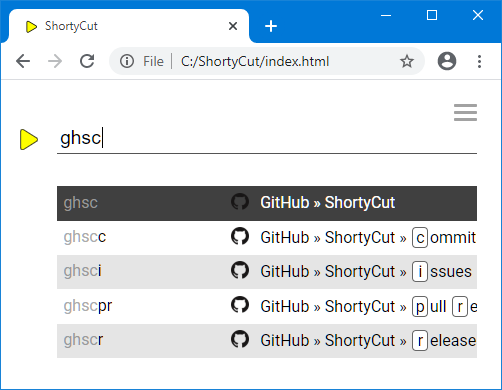

#  Grouping

Grouping can be used to reduce the number of suggestions on ShortyCut's homepage. This is useful when similar shortcuts have keywords that start with the same letters. One example is GitHub, where it can be handy to not only quickly access specific projects, but also their various pages (like releases, pull requests, and issues):

```text
[gh]       GitHub                          https://github.com/

[ghsc]     GitHub ShortyCut                https://github.com/david-04/shortycut
[ghscc]    GitHub ShortyCut commits        https://github.com/.../commits
[ghscr]    GitHub ShortyCut releases       https://github.com/.../releases
[ghsci]    GitHub ShortyCut issues         https://github.com/.../issues
[ghscpr]   GitHub ShortyCut pull requests  https://github.com/.../pulls

[ghmkd]    GitHub MkDocs                   https://github.com/mkdocs/mkdocs
[ghmkdc]   GitHub MkDocs commits           https://github.com/.../commits
[ghmkdr]   GitHub MkDocs releases          https://github.com/.../releases
[ghmkdi]   GitHub MkDocs issues            https://github.com/.../issues
[ghmkdpr]  GitHub MkDocs pull requests     https://github.com/.../pulls
```

This example uses a naming convention that's quite easy to remember. Keywords always start with `gh` for GitHub, followed by the project (e.g. `sc` for ShortyCut). An optional page (e.g. `i` for issues) can be appended at the end.

Using this naming convention quickly leads to a lot of keywords starting with `gh`, which can mess up the suggestions on ShortyCut's homepage. Typing `g`, for example, would flood the list with GitHub suggestion, obstructing the view and hiding other (potentially more relevant) shortcuts:


Grouping can be used to reduce the number of suggestions and get more relevant results. It is disabled by default and needs to be activated by setting the configuration property [enableGrouping](configuration.md#shortcutformatenablegrouping) to `true`:

```javascript
shortycut.configure({
    shortcutFormat: {
        enableGrouping: true
    },
});
```

When grouping is enabled, the keywords can be segmented and intertwined with the description:

```text
[gh] GitHub                                      https://github.com/

[gh] GitHub [sc]  ShortyCut                      https://github.com/david-04/shortycut
[gh] GitHub [sc]  ShortyCut [c]  commits         https://github.com/.../commits
[gh] GitHub [sc]  ShortyCut [r]  releases        https://github.com/.../releases
[gh] GitHub [sc]  ShortyCut [i]  issues          https://github.com/.../issues
[gh] GitHub [sc]  ShortyCut [pr] pull requests   https://github.com/.../pulls


[gh] GitHub [mkd] MkDocs                         https://github.com/mkdocs/mkdocs
[gh] GitHub [mkd] MkDocs    [c]  commits         https://github.com/.../commits
[gh] GitHub [mkd] MkDocs    [r]  releases        https://github.com/.../releases
[gh] GitHub [mkd] MkDocs    [i]  issues          https://github.com/.../issues
[gh] GitHub [mkd] MkDocs    [pr] pull requests   https://github.com/.../pulls
```

The square brackets (`[` and `]`) are usually optional, but they must be used for all shortcuts that use grouping. On the other hand, grouping itself is optional can be applied selectively to only those shortcuts that benefit from it.

On ShortyCut's homepage, grouped shortcuts unfold level by level. For example, after typing `g`, all GitHub links are hidden behind a single suggestion:


Once the GitHub part of the keyword (`gh`) is entered completely, the individual projects become visible. Pages beneath them, like releases or issues, are still hidden:


The various pages for a single project become only visible when the input matches the full project part of the keyword:


