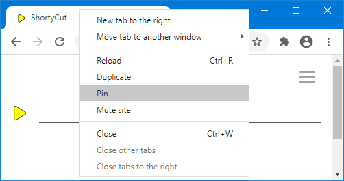
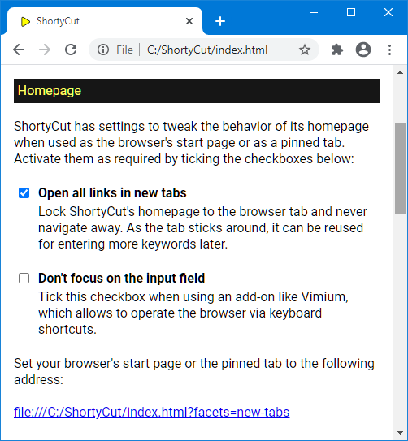

#  Homepage

The easiest way to access ShortyCut is to set its homepage as the browser's start page. However, the start page is usually not loaded when opening new tabs. This makes it rather complicated to access ShortyCut. It's usually easier to keep one tab with the homepage open at all times and reuse it whenever needed. This can be done by pinning the tab via the context menu:

When reusing the homepage tab, it's important that it does not navigate to other pages when keywords are entered. ShortyCut contains an option that causes all links to be opened in new tabs. This effectively locks the homepage to its tab, so that it can be reused over and over again.

Homepage settings related to its use as the start page or as a pinned tab, are added as parameters in the browser's address bar. Links with preconfigured settings can be created through the browser integration page, which is accessible via the menu:

The "Homepage" section lists different behaviors that can be activated by ticking the corresponding checkboxes:

The link displayed at the bottom of the section incorporates the selected settings. It should be used as the browser's start page or as the pinning tab.
