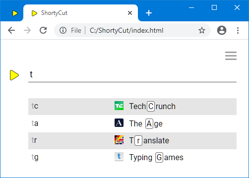

#  Hotkeys

When ShortyCut displays suggestions, it shows the keyword and highlights the next letters to type in the description:


The letters highlighted as hotkeys might not be the best choice if keywords follow specific patterns. For example, they might be composed of the first letter of each word, like `tg` for "`T`yping `G`ames". The automatic highlighting does not consider those rules and highlights the wrong `g`.

To work around this problem, hotkeys can be explicitly marked when defining shortcuts. This is done by putting a designated symbol in front of each hotkey within the description. Any symbol can be used, but it must be configured as [hotkeyMarker](configuration.md#shortcutformathotkeymarker) first:

```javascript
shortycut.configure({
    shortcutFormat: {
        hotkeyMarker: '_'
    }
});
```

In this example, the underscore (`_`) can be used to mark the correct hotkeys:

```text
[tr] Translate       https://dict.leo.org/ende?search=%s
[ta] The Age         https://www.theage.com.au/
[tg] _Typing _Games  https://www.typing.com/student/game
[tc] _Tech_Crunch    https://techcrunch.com
```

It's important that the hotkeys are aligned with the keyword. ShortyCut disregards markers if the letters don't match. On the other hand, there's no need to mark hotkeys if the automatic highlighting would pick the right ones anyway. ShortyCut uses the designed hotkeys where possible, and resorts to automatic highlighting in all other cases:



The hotkey highlighting can be turned off by setting the configuration property [showHotkeys](configuration.md#homepagesuggestionsshowhotkeys) to `false`. This can be useful if the description only rarely contains all letters from the keyword. On the other hand, if the descriptions are usually hotkey-friendly, the keywords displayed on the left-hand side can be hidden by setting the configuration property [showKeywords](configuration.md#homepagesuggestionsshowkeywords) to `false`.
