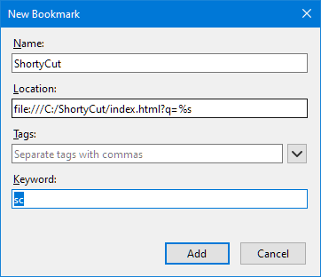

#  Keyword query

This integration method only works with browsers that natively support keywords (e.g. Firefox, Chrome, and other Chromium-based browsers). It's an easy way to make ShortyCut accessible through the browser's address bar. A dedicated keyword (e.g. `sc`) is assigned to ShortyCut itself and needs to be entered before the actual keyword. For example, if the shortcut `e` performs a product search on eBay, then a search for sunglasses would be started via:

The dedicated keyword for ShortyCut allows it to be used on a case-by-case basis when needed, while preserving the address bar's default behavior for everything else.

##  Firefox

To create a keyword query in Firefox, open the browser integration page via the homepage's menu:

Scroll down to the "Keyword query" section, right-click on the input field, and select "Add a Keyword for this Search...":

This will open a "New Bookmark" dialog. Enter a keyword (e.g. `sc`) and save the changes:

Alternatively, copy the link displayed at the bottom of the "Keyword query" section, create a new bookmark and assign the keyword there:

The keyword can also be changed later in the properties' dialog when editing the bookmark.

##  Chrome and other Chromium-based browsers

To create a keyword query in Chrome or other Chromium-based browsers, open the browser integration page via the homepage's menu:

Scroll down to the "Keyword query" section and copy the link at the bottom of the section:

Open the browser settings, scroll down to the "Search engine" section, and select "Manage search engines":

Under "Other search engines", click the "Add" button:

Give the search engine a name (e.g. `ShortyCut`), assign a keyword (e.g. `sc`), and paste the link from the browser integration page:

Chrome can also use ShortyCut as the default search engine. If so, the shortcut (e.g. `sc`) can be omitted. Everything that's entered in the browser's address bar is passed on to ShortyCut automatically. To enable this feature, click on the three dots to the right of the ShortyCut search engine and select "Make default":

Using ShortyCut as the default search engine disables all other features of the address bar. It particularly prevents the display of search engine suggestions as you type.
