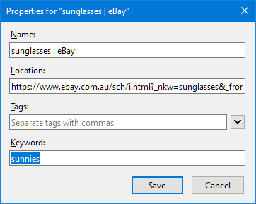
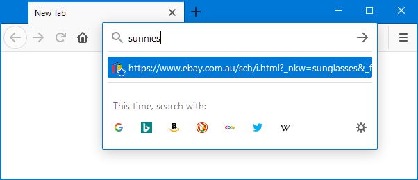
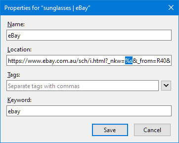
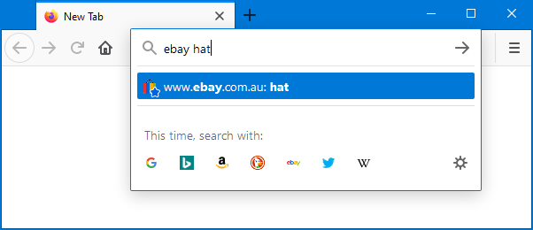

#  Keywords

Some browsers allow assigning keywords to bookmarks.
Instead of having to find and click on the bookmark itself,
the page can be opened by entering the keyword in the browser's address bar.
This is quicker than navigating through the bookmark collection.

##  The chore of browsing

Websites are continuously growing as more content and new features are added.
This makes them more useful, but also adds complexity.
Finding relevant information often involves visiting multiple intermediate pages.
Each of them takes effort (to find and click on the right link) and time (to wait for the next page to load).
Navigating in small steps - one at a time - is neither efficient nor enjoyable.

One example of click-intensive browsing is online shopping.
Getting the most relevant results often requires multiple filters to be applied.
Imagine you're in Australia and - with summer approaching fast - in urgent need of a nice (and cheap) pair of sunnies.
To find suitable offers, you might go through a couple of steps:

* Open ebay.com.au (or use a search engine for lesser-known domains)
* Enter the term "sunglasses" into the search field
* Select the category "men" or "women" (to fit your style)
* Change the sort order to "price" (so that the cheapest offers appear on top)
* If not logged in, set the delivery location (to get the correct shipping rates)
* Deselect auctions (because you want to buy it now)
* Filter Australian offers only (to get it delivered as soon as possible)
* Customize further as required (e.g. free returns only or more results per page)

Finding the perfect pair of sunglasses can be hard work.
But there are shortcuts available.

##  Keyword bookmarks

Most websites add filters and other settings to the URL
(the address displayed in the browser's address bar).
This allows the customized view to be bookmarked.
When revisiting the page, all filters are restored automatically.
This can speed things up, but searching for the right bookmark takes time, too.
That's where keywords come into play.
In Firefox, they can be added in the bookmark properties dialog:



Once a keyword has been assigned, it can be entered in the browser's address bar:



With keywords it's easy to catch up on the latest offers without a single click:

* Press `Ctrl` + `L` (to focus on address bar) or `Ctrl` + `T` (to open a new tab)
* Enter the keyword `sunnies`
* Press `Enter`

This will open the bookmarked page and restores all filters.
There's no need to step through intermediate pages, customize the listing or find the right bookmark.

##  Keyword searches

Keyword bookmarks are great for quickly restoring filters and directly accessing nested pages.
But they're also kind of a one-trick pony and always produce the same page view.
A more versatile form are keyword searches.
They work with websites that allow searching for things like products, news, or images.
Like filters and settings, the search term is usually included in the page's address:

```text
https://www.ebay.com.au/sch/i.html?_nkw=sunglasses&_from=R40&LH_PrefLoc=1
```

Once such a page has been bookmarked, it can be turned into a keyword search by replacing the original search term
`sunglasses` with `%s` (which is as a special placeholder recognized by the browser):



This bookmark allows searching for any product on eBay and is no longer limited to sunglasses.
It's used by entering the keyword (`ebay`) followed by the search term (e.g. `hat`) in the address bar:



This will open eBay, restore all bookmarked filters, and search for hats.

##  Limitations

Keywords are incredibly handy.
They bypass long-winded navigation steps, restore filter settings, and open the right page straight away.
As a native browser feature, they do have some limitations, though.

In Chromium-based browsers, for example, the usability is not great.
To assign keywords, bookmarks need to be added as search engines.
This is done in the settings and less convenient than working with regular bookmarks.
Search engines can't be organized in folders either.
All keywords end up in one long list, making it hard to maintain them.

Some browsers, don't support keywords at all.
And those that do, usually lack the ability to synchronize them with other browsers.
Keywords need to be maintained separately when using different browsers simultaneously.
