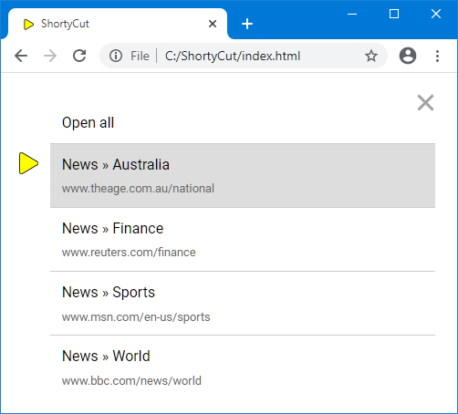

#  Multi-link shortcuts

Sometimes web pages provide similar or complementing information. For example, news websites usually have index pages per category and region. Separate keywords can be used to bookmark them individually:

```text
[news-au]       News » Australia  https://www.theage.com.au/national
[news-finance]  News » Finance    https://www.reuters.com/finance
[news-sports]   News » Sports     https://www.msn.com/en-us/sports
[news-world]    News » World      https://www.bbc.com/news/world
```

As the number of keyword variations grows, it becomes harder to remember them. It's usually easier to assign all related pages to the same keyword:

```text
[news]          News » Australia  https://www.theage.com.au/national
[news]          News » Finance    https://www.reuters.com/finance
[news]          News » Sports     https://www.msn.com/en-us/sports
[news]          News » World      https://www.bbc.com/news/world
```

When entering a keyword with multiple links, ShortyCut shows a list to choose from:



The "Open all" item on top of the list can be used to open all links in new tabs. This can also be set as the default behavior in the [configuration](configuration.md#shortcutformaturlmultilinkindicatordefault), causing ShortyCut to always open new tabs without showing the list first. On top of that, each shortcut can override the default behavior and enforce to either show the list or open new tabs.

##  Show a list

A question mark (`?`) in front of links causes the keyword to always show the list:

```text
[news]  News » Australia  ?https://www.theage.com.au/national
[news]  News » Finance    ?https://www.reuters.com/finance
[news]  News » Sports     ?https://www.msn.com/en-us/sports
[news]  News » World      ?https://www.bbc.com/news/world
```

In this example, the `news` keyword will always show the list, even if the default behavior is set to open new tabs.

##  Open new tabs

A caret (`^`) in front of links causes the keyword to always open new tabs:

```text
[news]  News » Australia  ^https://www.theage.com.au/national
[news]  News » Finance    ^https://www.reuters.com/finance
[news]  News » Sports     ^https://www.msn.com/en-us/sports
[news]  News » World      ^https://www.bbc.com/news/world
```

In this example, the `news` keyword will always open new tabs, even if the default behavior is set to show the list.

##  Ignore previous links

An equals sign (`=`) in front of a link causes all previous links to be discarded:

```text
[news]  News » Australia  ?https://www.theage.com.au/national
[news]  News » Finance    ?https://www.reuters.com/finance
[news]  News » Sports     ?https://www.msn.com/en-us/sports
[news]  News » World      =https://www.bbc.com/news/world
```

In this example, importing the last line will cause ShortyCut to discard all previous links. The `news` keyword is treated as if it had only one link (world news). It's the same effect as if the first three lines were not there at all.

Ignoring previous links is rarely needed. It can be used to override individual keywords when importing shared shortcut collections. It can also be used to temporarily redirect or repurpose a keyword, without having to delete (and later restore) the current set of links.

##   Mixing behaviors

The equals sign (`=`) always causes the previous links to be discarded. The behavior for the remaining shortcuts is determined only by the last link.

```text
[news]  News » Australia   https://www.theage.com.au/national
[news]  News » Finance    =https://www.reuters.com/finance
[news]  News » Sports     ^https://www.msn.com/en-us/sports
[news]  News » World      ?https://www.bbc.com/news/world
```

In this example, the equals sign (`=`) in finance news causes the previous link (Australia news) to be discarded. The keyword will eventually have three links (finance, sports, and world news). A list will be displayed, because the last link (world news) has a question mark (`?`). If it didn't have any indicator, the configured default behavior would apply. The caret (`^`) in front of the sports link is always ignored and can be omitted.

##  Search buckets

The hash symbol (`#`) in front of a link marks it as "searchable". These links are not directly opened through the keyword but are accessible via full-text search only. Searchable links exist in parallel to the regular links that open new tabs or show an interactive list. Please see "[Search buckets](search-buckets.md)" for a more detailed explanation.
