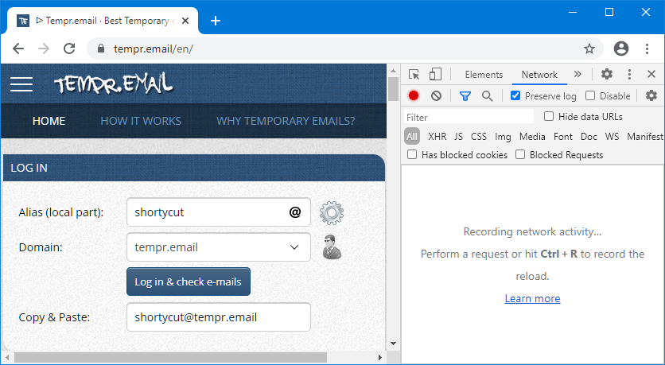

#  POST links

Some pages transmit data via the `POST` method,
which prevents filters and settings from showing up in the browser's address bar.
It's often used for sensitive input like usernames and passwords.
As a side effect, these pages can't (and often shouldn't) be bookmarked.
But in some cases it's safe and handy to create a shortcut nevertheless.


##  Link syntax

A regular link becomes a `POST` link by appending `?POST?` followed by the data to be transmitted:

```text
[ebay] eBay http://localhost/my-app/sign-in?POST?user=shortycut&password=secret
```

In this example, the username `shortycut` and the password `secret` would be transmitted
without showing up in the browser's address bar.
The fields must be in `key=value` format and separated by an ampersand (`&`).
The placeholder `%s` can be used like in any other link:

```text
[ebay] eBay http://localhost/my-app/sign-in?POST?user=shortycut&password=%s
```

In this example, the password needs to be entered alongside the keyword.
Typing `ebay secret` in the browser's address bar would attempt to log in user `shortycut` with the password `secret`.

##  URL-Encoding

All keys and values (except for the `%s` placeholder) must be URL-encoded.
This means that most characters apart from letters and digits can't be used directly.
One example is the `@` symbol, which needs to be written as `%40` instead.
If the username was `me@gmail.com`, the login link would look like this:

```text
[ebay] eBay http://localhost/my-app/sign-in?POST?user=me%40gmail.com&password=%s
```

ShortyCut includes link tools, which can be used to quickly encode any text.
It's accessed via the burger icon on the upper right-hand side of the homepage:


The section for URL-encoding contains two fields, one for the plain text and one for the URL-encoded version.
Everything typed into the plain text field is encoded immediately.
The result is displayed in the field below:


Text that is already encoded can also be decoded by entering it into the URL-encoded field.


##  Extracting POST links

Preparing a `POST` link can be a bit of a  scavenger hunt.
The field names can't be seen in the browser's address bar and usually need to be extracted from the page's source code.
An easier way is to automatically extract the links from the network traffic recorded by the browser.
The instructions below are based on Chrome, but it can be done in most other browsers as well.

The first step is to open the page and populate the form fields.
Before clicking the submit button, right-click anywhere on the page and select "Inspect":


This will open the browser's developer tools on the side or at the bottom of the window.
Switch to the "Network" tab and tick the "preserve log" checkbox.
In some browsers this might be hidden in the menu and have a different name (e.g. "persist log"):



Now submit the form (in this example by clicking on "Log in & check e-mails").
The browser will record and display all network traffic in the "Network" tab:


Once the page has been loaded, right-click on the network traffic
and copy (or save) all requests as HAR (HTTP archive):


Then open ShortyCut's link tools via the burger icon on the homepage:


Scroll down to the section for extracting `POST` links and paste the HTTP archive (HAR) data into the text field:


ShortyCut will extract all `POST` requests and display the matching links below the input field.
The links are already URL-encoded and can be modified as required (e.g. by replacing a value with the `%s` placeholder).
