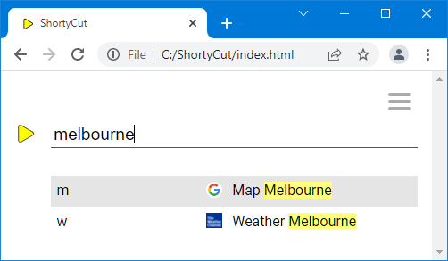

#  Search buckets

ShortyCut's homepage can perform a full-text search across all bookmarks. This happens automatically when the input does not match any keywords. The full-text search is great for rarely accessed pages that don't require a dedicated keyword. Search buckets can be used to limit the scope of the full-text search.

## Full-text search

A bookmark collection might contain links to the weather forecast and maps of selected cities:

```text
[w] Weather             https://weather.com/
[w] Weather Melbourne  ?https://weather.com/melbourne
[w] Weather Sydney     ?https://weather.com/sydney

[m] Map                 https://www.google.com.au/maps/
[m] Map Melbourne      ?https://www.google.com.au/maps/melbourne
[m] Map Sydney         ?https://www.google.com.au/maps/sydney
```

In this example, the links are marked with `?`. When entering a keyword (`w` or `m`), ShortyCut would display a list of all links for interactive selection.

A specific link can also be accessed by performing a full-text search, for example by entering the name of a city:



The full-text search returns results from all bookmarks in the collection, including both weather and maps.

## Scoped search

Keywords can have "searchable" links. By default, they are prefixed with the hash symbol (`#`):

```text
[w] Weather             https://weather.com/
[w] Weather Melbourne  #https://weather.com/melbourne
[w] Weather Sydney     #https://weather.com/sydney

[m] Map                 https://www.google.com.au/maps/
[m] Map Melbourne      #https://www.google.com.au/maps/melbourne
[m] Map Sydney         #https://www.google.com.au/maps/sydney
```

When solely entering the keyword (`w` or `m`), only the first link (without the `#`) would be opened. The searchable links are only accessible via the full-text search. However, it can now be restricted to one bucket by entering the respective keyword first:


In this example, the full-text search only considers searchable links that are attached to the keyword `w`.

The symbol used to mark searchable links (`#` by default) can be changed by setting the [searchBucket](configuration.md#shortcutformaturlmultilinkindicatorsearchbucket) configuration property.
