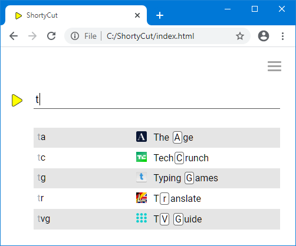

#  ShortyCut

ShortyCut is a small JavaScript application that enhances the capabilities of keywords
and makes them available in a wider range of browsers.

##  Homepage

ShortyCut's homepage can be used to enter keywords (rather than typing them into the browser's address bar).
Along the way it provides suggestions, making it easier to find the right shortcut:



When no keyword matches, suggestions are drawn from the shortcuts' descriptions.
This allows to search through the bookmark collection without having to remember the keyword.

##  Address bar integration

While the homepage works in all browsers and is easy to set up,
it's also possible to enter keywords in the address bar.
For most browsers, this requires a small web server, which already comes bundled with ShortyCut.

##  Shortcuts as text file

Shortcuts are stored as plain text and can be edited in any text editor.
This makes it easy to reorganize, back up and share them with others.
Each shortcut contains a keyword, an optional description and a link:

```text
[sunnies] Sunglasses at eBay https://www.ebay.com.au/sch/i.html?_nkw=sunglasses
[ebay]    Search eBay        https://www.ebay.com.au/sch/i.html?_nkw=%s&_sacat=0
```

The same file with shortcut definitions is loaded wherever ShortyCut is started.
When using multiple browsers, the keywords are available in all of them, without requiring any synchronization.

##  Multi-link shortcuts

The same keyword can be assigned to multiple links.
ShortyCut can open all of them in separate tabs or show a list to choose from:


The default behavior can be configured globally and - if required - overridden for each keyword individually.

##  POST links

Most web pages lend themselves naturally to bookmarking by including all filters and settings in their address.
However, sometimes sensitive data like passwords should not be visible in the browser's address bar.
In those cases, pages use the `POST` method, where the data is transmitted separately.
ShortyCut allows to bookmark and reopen these pages as if they supported filters and settings in their address.

##  Generated bookmarks

Shortcuts can not only be defined as plain text, but also generated through JavaScript code.
This can be useful when links follow a similar pattern.
For example, when working with GitHub repositories,
it might be handy to have shortcuts for different aspects of a project:

```text
[scc]  ShortyCut commits       https://github.com/david-04/shortycut/commits/main
[scr]  ShortyCut releases      https://github.com/david-04/shortycut/releases
[sci]  ShortyCut issues        https://github.com/david-04/shortycut/issues
[scpr] ShortyCut pull requests https://github.com/david-04/shortycut/pulls
```

Similar shortcuts for other projects can be created by replacing the user and repository name in the link.
Instead of copying and pasting, those shortcuts can be generated dynamically by writing JavaScript code.
