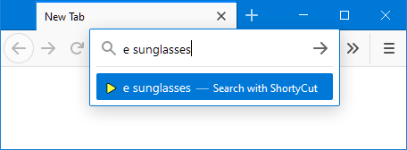

#  Web server

ShortyCut can be installed as the browser's default search engine when accessed through a web server. Once set up, keywords can be entered directly in the browser's address bar:



This method requires a web server to run on the local machine or ShortyCut to be uploaded to a web hosting service.

##  Chromium-based browsers

It's not necessary to run a web server when using a Chromium-based browser. Instead, create a keyword query as the default search engine. See "[Keyword query](keyword-query.md#chrome-and-other-chromium-based-browsers)" for details. For all other browsers follow the instructions below.

##  Starting the built-in web server

ShortyCut comes bundled with a small web server. It requires a Java runtime environment from Oracle (e.g. [OpenJDK](https://openjdk.java.net/)) to be installed. The web server is located in the `resources` folder. On Windows, it can be started by double-clicking on `web-server.bat`.

```text
shortycut
  +-- data
  +-- resources
  |     +-- web-server.bat
  |     +-- web-server.jar
  +-- index.html
```

It requires the environment variable `JAVA_HOME` or `PATH` to point to the folder where Java is installed. One of them should be set automatically when installing Java. On all other operating systems, the web server needs to be started manually via the command line:

```text
javaw -jar web-server.jar
```

The web server must be running whenever keywords are entered in the browser's address bar. It's best to create a start-up task to automatically restart the web server after each reboot.

##  Using a web hosting service

Rather than running a local web server, ShortyCut can also be uploaded to a web hosting service. However, it needs to be re-uploaded over and over again, whenever shortcuts are added, removed, or modified. Before uploading it for the first time, open `search.xml` from the `data` folder in a text editor and update the following two lines:

```xml
<Image width="16" height="16" type="image/x-icon">http://localhost:4171/resources/favicon.ico</Image>
<Url type="text/html" template="http://localhost:4171/index.html?q={searchTerms}" />
```

Replace `http://localhost:4171/` with the domain and path where ShortyCut will eventually be accessed (e.g. `https://www.my-website.com/shortycut/`). Then upload the whole ShortyCut folder to the web hosting server.

##  Add search engine to browser

To add ShortyCut as a search engine, open it through the web server. When using a web hosting service, use the domain and path where the uploaded files can be accessed (e.g. https://www.my-website.com/shortycut/). When running the built-in web server locally, go to:

[http://localhost:4171/](http://localhost:4171/)

If accessed through a web server (and not loaded directly from the disk drive), ShortyCut is detected automatically by the browser and can be added to the search engines:


Once it has been added, keywords can be entered in the browser's search field. To be able to enter them in the address bar as well, select ShortyCut as the default search engine in the browser settings:


After that, keywords can be entered directly in the browser's address bar:


Using ShortyCut as the default search engine will replace the address bar's default behavior. It will especially block suggestions that are usually displayed as you type.

##  Using encrypted connections

Some browsers only detect and accept search engines that are accessed via encrypted `https`. When using such a browser in combination with the built-in web server, open ShortyCut via this link:

[https://localhost:4172/](https://localhost:4172/)

The built-in web server uses a self-signed certificate for the encryption. This will cause browser warnings. Confirm that the page should be trusted and opened nevertheless.

##  Configuring the built-in web server

The built-in web server has a few settings that can be tweaked. They are configured in `web-server.properties` located in the `data` folder. The file contains comments explaining the different settings.
